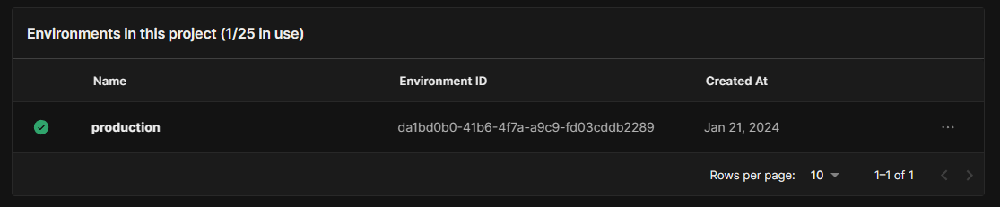
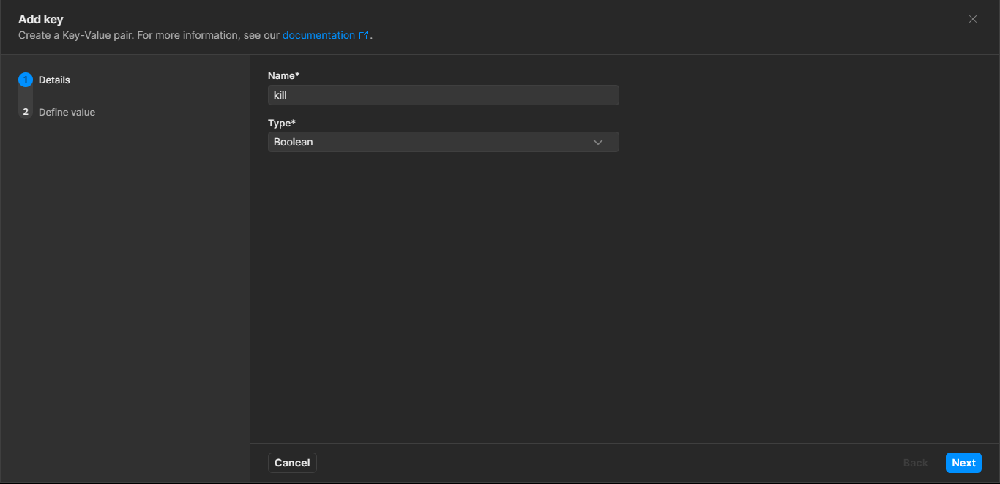

# Setup

#### Step 1: Download the Project

#### Step 2: Open in Unity

#### Step 3: Customize the UI to your requirements, though these can be edited remotely too!

#### Step 4: The Remote Config and Authentication packages should already be installed but if they aren't go ahead and install them

#### Step 5: Go to the [Unity Cloud Dashboard](https://cloud.unity.com/) and click on the Dashboard tab. Sign in/up if necessary

### Step 6: Create a new Project if you don't have one

### Step 7: Enter the Project View

### Step 8: Launch Remote Config under Services

### Step 9: You fill find some pop-ups and on-boarding steps. Click on Check Environements

### Step 10: Create new environments or just choose Confirm to continue with the Production environment

### Step 11: Click on the Drop Down with the chosen environment

### Step 12: Click on Manage Environments and Scroll down till you find the Environment ID

### Step 13: Copy this ID

### Step 14: Go back to the Config tab on the Remote Config Service

### Step 15: Now visit the Unity editor and Click on the Launcher GameObject to edit it in the inspector and Check Out the Remote Config Variables

### Step 16: Enter the previously copied ID in the Environement ID slot and configure the variable names for remote config as you wish

### Step 17: Create all the variables in the actual Remote Config dashboard as "Keys" with their correct values (What [values](./Files.md)?)

### Step 18: Publish

### Step 19: Go to the main project view which we visit at Step 7 
### Step 20: Go back to the Unity Editor and Click on the Services option in the title ribbon

### Step 21: Go to General Settings and choose your Organisation and Project and click on "Link Unity project to cloud project"

# Hosting
You can host the files on and http hosting service like dropbox, google drive or even onedrive. You would need to convert the links to direct download links using some kind of online converters. 
For example this is a direct download link for a dropbox file `https://www.dropbox.com/s/SOME_ID/Application_Zip?dl=1`

Google Drive shows a pop-up if the file is more than 50mb which breaks the download http request. You can either use [Google APIs](https://bytesbin.com/skip-google-drive-virus-scan-warning-large-files/) to get rid of the whole problem altogether... Or you could even do a [workaround via code](https://stackoverflow.com/a/44402826)

So the Remote Config variables would point to these variables... Here is an example (acknowledgement is basically subtitle.. I renamed it for my project)

### Also the \_name variables should be equal the name for the Zip files

### Step 22: ANDDDD you are done! Export the project to all required platforms and it 'should' work perfectly fine
